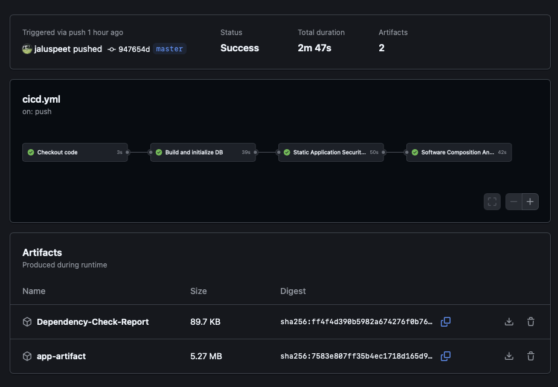
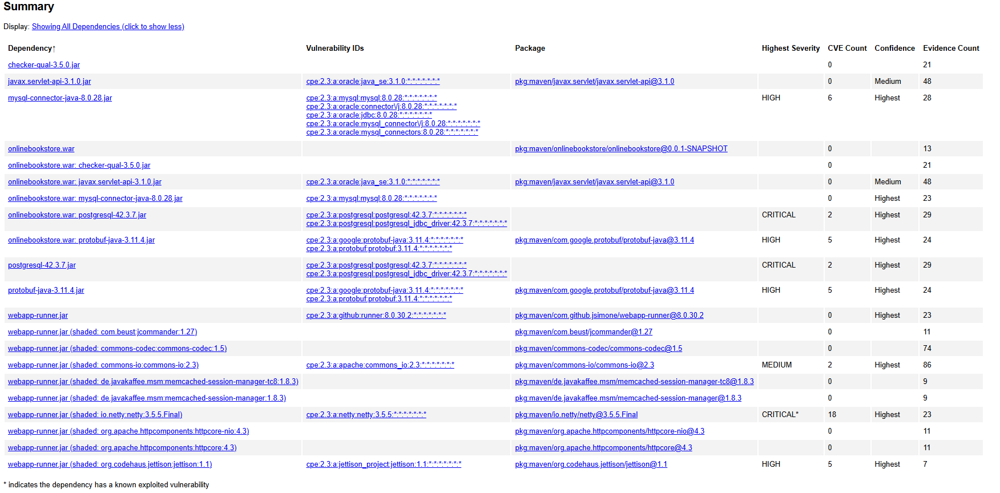

# Relazione del Progetto di "Sicurezza dei Sistemi e Privacy"
## introduzione
Il presente progetto si propone di implementare un processo di sviluppo sicuro (SSDLC - Secure Software Development Life Cycle) secondo l'approccio SecDevOps, attraverso la configurazione di una pipeline CI/CD per un'applicazione sviluppata in Java.
Il repository selezionato per l'attività è [onlinebookstore](https://github.com/shashirajraja/onlinebookstore), un progetto Java che simula un sistema di gestione per una libreria online..

Per la realizzazione della pipeline CI/CD sono stati adottati i seguenti strumenti e tecnologie: 
* GitHub Actions per l’automazione del processo CI/CD;
* Maven per la gestione del ciclo di vita del progetto e della fase di build;
* SonarQube per la scansione SAST (Static Application Security Testing) e la valutazione della qualità del codice;
* OWASP Dependency-Check per l’analisi SCA (Software Composition Analysis) delle librerie di terze parti utilizzate;
* Quality/Security Gate configurato per bloccare la pipeline in presenza di vulnerabilità critiche o violazioni gravi delle regole di qualità;
* Artifact archiving per il salvataggio dell’output di build (JAR file);
* Sistema di notifica per segnalare l’esito delle analisi al team di sicurezza (GitHub Actions).

L’obiettivo principale è dimostrare come l'integrazione di strumenti di sicurezza nel ciclo di vita del software possa aumentare l'affidabilità e la resilienza delle applicazioni, promuovendo al contempo pratiche di sviluppo sicuro.

## Configurazione dell'ambiente di sviluppo

### Stage 1-2-6
- Checkout del codice - viene clonato l'ultimo commit del repository, su cui lavora la pipeline
  ```yaml
  checkout:
    name: Checkout code
    runs-on: ubuntu-latest
    outputs:
      code-dir: ${{ steps.checkout.outputs.path }}
    steps:
      - name: Checkout code
        id: checkout
        uses: actions/checkout@v3
  ```
- Avvio del servizio MySQL - crea un secondo container con MySQL e avvia il servizio in background.
 ```yaml
services:
   mysql:
   image: mysql:5.7
      env:
        MYSQL_ROOT_PASSWORD: root
        MYSQL_DATABASE: onlinebookstore
      ports:
        - 3306:3306
      options: >-
        --health-cmd="mysqladmin ping -h 127.0.0.1 --silent"
        --health-interval=10s
        --health-timeout=5s
        --health-retries=5
```
- Setup di Java SDK (versione 17, distribuzione temurin)
  ```yaml
  name: Set up JDK 17 (Temurin)
    uses: actions/setup-java@v3
    with:
      java-version: 17
      distribution: temurin
  ```
- Attesa dell'avvio del servizio di di MySQL (tramite ping) e nizializzazione del database con dei valori di test.
```yaml
- name: Wait for MySQL to be ready
        run: |
          for i in {1..30}; do
          if mysqladmin ping -h127.0.0.1 -uroot -proot --silent; then
          echo "MySQL is ready!"
          break
          fi
          echo "Waiting for MySQL..."
          sleep 2
          done

      - name: Initialize database
        run: |
          mysql -h127.0.0.1 -uroot -proot <<EOF
          USE onlinebookstore;
          CREATE TABLE IF NOT EXISTS books(
          barcode VARCHAR(100) PRIMARY KEY,
          name VARCHAR(100),
          author VARCHAR(100),
          price INT,
          quantity INT
          );
          CREATE TABLE IF NOT EXISTS users(
          username VARCHAR(100) PRIMARY KEY,
          password VARCHAR(100),
          firstname VARCHAR(100),
          lastname VARCHAR(100),
          address TEXT,
          phone VARCHAR(100),
          mailid VARCHAR(100),
          usertype INT
          );
          INSERT INTO books VALUES(
          '9780134190563',
          'The Go Programming Language',
          'Alan A. A. Donovan and Brian W. Kernighan',
          400,
          8
          );
          INSERT INTO users VALUES(
          'shashi',
          'shashi',
          'Shashi',
          'Raj',
          'Bihar',
          '1236547089',
          'shashi@gmail.com',
          2
          );
          COMMIT;
          EOF

```
- Build con Maven e upload dell'artefatto eseguibile (`onlinebookstore.war`) in modo da allegarlo all'output finale.
```yaml
 - name: Build (Maven)
        run: mvn clean install -B

      - name: Upload JAR artifact
        uses: actions/upload-artifact@v4
        with:
          name: app-artifact
          path: target/*.war
```

### Stage 3
Effettua una scansione SAST con SonarQube per l'analisi statica del codice.
```yaml
 sast:
    name: Static Application Security Testing (SAST)
    runs-on: ubuntu-latest
    needs: build
    steps:
      - name: Checkout code
        uses: actions/checkout@v3
        with:
          fetch-depth: 0

      - name: Set up JDK 17 (Temurin)
        uses: actions/setup-java@v3
        with:
          java-version: 17
          distribution: temurin

      - name: Cache SonarQube packages
        uses: actions/cache@v4
        with:
          path: ~/.sonar/cache
          key: ${{ runner.os }}-sonar
          restore-keys: ${{ runner.os }}-sonar

      - name: Cache Maven packages
        uses: actions/cache@v4
        with:
          path: ~/.m2/repository
          key: ${{ runner.os }}-m2-${{ hashFiles('**/pom.xml') }}
          restore-keys: ${{ runner.os }}-m2

      - name: Run SonarQube Scanner
        env:
          SONAR_TOKEN: ${{ secrets.SONAR_TOKEN }}
        run: mvn -B verify org.sonarsource.scanner.maven:sonar-maven-plugin:sonar -Dsonar.projectKey=jaluspeet_onlinebookstore
```

### Stage 4
Effettua una scansione SCA con Dependecy Check e allega il report delle vulnerabilità (`dependency-check-report.html`) all'output.
```yaml
sca:
    name: Software Composition Analysis (SCA)
    runs-on: ubuntu-latest
    needs: sast
    steps:
      - name: Checkout code
        uses: actions/checkout@v3

      - name: Build project with Maven
        run: mvn clean install -B

      - name: Run Dependency Check
        uses: dependency-check/Dependency-Check_Action@main
        continue-on-error: true
        env:
          JAVA_HOME: /opt/jdk
        with:
          project: onlinebookstore
          path: '.'
          format: HTML
          out: reports
          args: >
            --failOnCVSS 7
            --enableRetired

      - name: Upload Dependency Check report
        uses: actions/upload-artifact@v4
        with:
          name: Dependency-Check-Report
          path: reports
```

### Stage 5
La pipeline viene automaticamente interrotta se uno dei due scan (SCA e SAST) fallisce. La causa del fallimento viene indicata nell'output del workflow di Github Actions, accessibile ad un eventuale team di sicurezza. Qui sotto è riportato un esempio di esito positivo della pipeline


### Stage 7
Viene automaticamente notificato tramite email un eventuale team di sicurezza, sfruttando la reportistica automatizzata di Github Actions.

## Analisi delle vulnerabilità trovate
Le scansioni automatiche integrate nella CI/CD pipeline hanno evidenziato la presenza di diverse dipendenze vulnerabili all’interno del progetto. Di seguito viene riportata l’analisi dettagliata vulnerabilità che richiedono intervento immediato.



### 1. Netty 3.5.5.Final
#### Descrizione 
Netty è una libreria Java utilizzata per la programmazione di rete asincrona. La versione 3.5.5.Final, integrata tramite webapp-runner.jar, contiene più vulnerabilità note e non più supportate. Le vulnerabilità più gravi riguardano:
- Deserializzazione non sicura: Consente a un attaccante remoto di inviare oggetti Java serializzati malevoli per ottenere esecuzione di codice arbitrario.
- Parsing HTTP vulnerabile: Errori nella gestione di header e messaggi HTTP possono portare a bypass di controlli o denial-of-service.

#### Output
```yaml
webapp-runner.jar (shaded: io.netty:netty:3.5.5.Final)	
cpe:2.3:a:netty:netty:3.5.5:*:*:*:*:*:*:*	
pkg:maven/io.netty/netty@3.5.5.Final	
```
#### Classificazione OWASP TOP 10
A08:2021 – Software and Data Integrity Failures

A05:2021 – Security Misconfiguration

A03:2021 – Injection (via unsafe deserialization)

#### Gravità e Impatti
- Gravità: CRITICA

Impatto potenziale:

- Esecuzione di codice arbitrario (RCE)

- Compromissione del server

- Denial-of-service

- Accesso non autorizzato

#### Fix del Codice
Rimozione o sostituzione del pacchetto webapp-runner.jar con uno strumento moderno e aggiornato.


### 2. PostgreSQL JDBC Driver 42.3.7
#### Descrizione 
Il driver JDBC PostgreSQL 42.3.7, utilizzato per la connessione al database, presenta vulnerabilità che compromettono la sicurezza della comunicazione e la gestione del failover. In particolare:
- CVE-2022-21724: Mancata verifica del certificato in alcune configurazioni SSL/TLS, che espone a attacchi MITM.
- CVE-2022-31197: Potenziale informazioni sensibili esposte in ambiente failover.

#### Output
```yaml
onlinebookstore.war: postgresql-42.3.7.jar
cpe:2.3:a:postgresql:postgresql:42.3.7:*:*:*:*:*:*:*
```
#### Classificazione OWASP TOP 10
A02:2021 – Cryptographic Failures

A01:2021 – Broken Access Control 

A05:2021 – Security Misconfiguration

#### Gravità e Impatti
- Gravità: CRITICA

Impatto potenziale:

- Compromissione della confidenzialità dei dati

- Attacchi MITM tra applicazione e database

- Perdita di integrità del canale di comunicazione

#### Fix del Codice
Aggiornare immediatamente il driver JDBC a una versione più moderna di 42.5.4 e rimuovere ogni versione duplicata del driver dallo .war.

### 3. MySQL Connector
#### Descrizione 
mysql-connector-java-8.0.28.jar è il driver JDBC per MySQL. In questa versione sono presenti diverse vulnerabilità che compromettono autenticazione, stabilità e gestione delle connessioni. Alcuni difetti sono legati alla gestione errata di pacchetti di handshake, che possono essere sfruttati per causare denial-of-service, memory leak, o potenziali escalation in caso di configurazioni deboli.

#### Output
```yaml
mysql-connector-java-8.0.28.jar
cpe:2.3:a:mysql:mysql:8.0.28:*:*:*:*:*:*:*
```
#### Classificazione OWASP TOP 10
A01:2021 – Broken Access Control

A09:2021 – Security Logging and Monitoring Failures

A07:2021 – Identification and Authentication Failures

#### Gravità e Impatti
- Gravità: ALTA

Impatto potenziale:

- Possibili crash dell’applicazione in ambienti ad alto carico

- Errori di autenticazione/connessione

- Problemi di compatibilità TLS

#### Fix del Codice
Aggiornare il driver JDBC alla versione 8.0.33 o successiva ed evitare configurazioni deboli come useSSL=false.


### 4. Protobuf Java 3.11.4
#### Descrizione 
Protobuf è una libreria per la serializzazione efficiente di dati. La versione 3.11.4 presenta falle nella gestione della deserializzazione binaria, che possono portare a execution of untrusted data, buffer overflow o DoS. In contesti con input non controllato il rischio è elevato.

#### Output
```yaml
protobuf-java-3.11.4.jar
cpe:2.3:a:google:protobuf-java:3.11.4:*:*:*:*:*:*:*
```
#### Classificazione OWASP TOP 10
A03:2021 – Injection

A08:2021 – Software and Data Integrity Failures

#### Gravità e Impatti
- Gravità: ALTA

Impatto potenziale:

- Stack overflow e quindi Denial of Service

- Deserializzazione pericolosa da fonti non affidabili

- Potenziale esecuzione non voluta di codice

#### Fix del Codice
Aggiornare a Protobuf Java 3.21.x o superiore e Validare sempre input e lunghezza dei messaggi ricevuti.


### 5. Jettison 1.1
#### Descrizione 
Jettison è una libreria che converte JSON in XML e viceversa. La versione 1.1 contiene vulnerabilità note che permettono attacchi di tipo XML External Entity e XML Injection, sfruttabili quando l’input XML non è adeguatamente sanificato.

#### Output
```yaml
webapp-runner.jar (shaded: org.codehaus.jettison:jettison:1.1)
cpe:2.3:a:jettison_project:jettison:1.1:*:*:*:*:*:*:*
```
#### Classificazione OWASP TOP 10
A05:2021 – Security Misconfiguration

A06:2021 – Vulnerable and Outdated Components

#### Gravità e Impatti
- Gravità: ALTA

Impatto potenziale:

- Lettura di file locali sul server (XXE)

- Esecuzione di richieste verso host interni (SSRF)

- Possibile injection nei messaggi XML

#### Fix del Codice
Aggiornare a Protobuf Java 3.21.x o superiore e Validare sempre input e lunghezza dei messaggi ricevuti.


### 6. Commons IO 2.3
#### Descrizione 
commons-io:commons-io:2.3 è una libreria Apache per operazioni su file e stream. La versione 2.3 è affetta da vulnerabilità che consentono, in certi casi, di accedere a file arbitrari su disco tramite percorsi relativi manipolati o path traversal. È pericolosa se un'applicazione accetta input da utenti per caricare o scrivere file.

#### Output
```yaml
webapp-runner.jar (shaded: commons-io:commons-io:2.3)
cpe:2.3:a:apache:commons_io:2.3:*:*:*:*:*:*:*
```
#### Classificazione OWASP TOP 10
A05:2021 – Security Misconfiguration

A01:2021 – Broken Access Control

#### Gravità e Impatti
- Gravità: MEDIA

Impatto potenziale:

- Possibile lettura di file sensibili fuori directory

- Rischio incrementato se combinato con upload o gestione file da parte di utenti

#### Fix del Codice
Validare con whitelist i nomi file ricevuti dall’utente oppure usare metodi come new File(baseDir, safeFileName).getCanonicalPath() per evitare accessi relativi.


### 7. javax.servlet-api 3.1.0
#### Descrizione 
javax.servlet-api:3.1.0 è la specifica Servlet Java usata nei container web. Pur non contenendo codice eseguibile direttamente dato che è una API, è obsoleta e può implicare incompatibilità con container sicuri o mancare di patch su parsing.

#### Output
```yaml
javax.servlet-api-3.1.0.jar
cpe:2.3:a:oracle:java_se:3.1.0:*:*:*:*:*:*:*
```
#### Classificazione OWASP TOP 10
A09:2021 – Security Logging and Monitoring Failures

A06:2021 – Vulnerable and Outdated Components

#### Gravità e Impatti
- Gravità: MEDIA

Impatto potenziale:

- Potenziali incompatibilità con patch di sicurezza moderne

- Debolezze non direttamente sfruttabili ma sfruttabili via container vulnerabili

#### Fix del Codice
Verificare compatibilità con il server di applicazione usato.


### 8. webapp-runner 8.0.30.2
#### Descrizione 
webapp-runner è un tool che permette di eseguire webapp .war standalone. Internamente usa una versione embedded di Tomcat 8, che è non più supportata da Apache dal 2016. Espone l’app a diverse CVE legate a parsing di cookie, header, e gestione delle sessioni.

#### Output
```yaml
webapp-runner.jar
pkg:maven/com.github.jsimone/webapp-runner@8.0.30.2
```
#### Classificazione OWASP TOP 10
A06:2021 – Vulnerable and Outdated Components

A05:2021 – Security Misconfiguration

#### Gravità e Impatti
- Gravità: MEDIA

Impatto potenziale:

- CVE-2016-0763 – session fixation

- CVE-2016-5018 – malformed request parsing bypass

#### Fix del Codice
Aggiornare webapp-runner con una versione aggiornata compatibile con Tomcat 9.0+ oppure valutare se usare una distribuzione standard di Tomcat esterna.


### 9. commons-codec 1.5
#### Descrizione 
commons-codec:1.5 è una libreria per codifiche come Base64, SHA, MD5. Questa versione implementa confronti di stringhe/digest in modo non costante nel tempo, rendendoli soggetti a timing attacks su token o password hash confrontate lato server.

#### Output
```yaml
webapp-runner.jar (shaded: commons-codec:commons-codec:1.5)
pkg:maven/commons-codec/commons-codec@1.5
```
#### Classificazione OWASP TOP 10
A02:2021 – Cryptographic Failures

#### Gravità e Impatti
- Gravità: MEDIA

Impatto potenziale:

- Rischio di ricostruzione di hash da parte di un attaccante via analisi tempi di risposta

- Impatta servizi che confrontano digest o token sensibili
  
#### Fix del Codice
Aggiornare a commons-codec 1.15 o superiore e per confronti sicuri, usare metodi "constant-time".

### 10. httpcore-nio 4.3
#### Descrizione 
org.apache.httpcomponents:httpcore-nio:4.3 è parte della libreria HTTP async di Apache. Questa versione contiene bug noti che possono causare resource exhaustion o gestione errata di header HTTP. Sfruttabile tramite richieste malformate o flood.

#### Output
```yaml
webapp-runner.jar (shaded: org.apache.httpcomponents:httpcore-nio:4.3)
pkg:maven/org.apache.httpcomponents/httpcore-nio@4.3
```
#### Classificazione OWASP TOP 10
A01:2021 – Broken Access Control

A03:2021 – Injection

#### Gravità e Impatti
- Gravità: MEDIA

Impatto potenziale:

- Nessuna CVE direttamente segnalata, ma noto come obsoleto e vulnerabile

- DoS tramite occupazione thread in richieste keep-alive

- Errori nella gestione header → spoofing o injection

#### Fix del Codice
Aggiornare a httpcore-nio 4.4.15 o superiore e impostare correttamente timeout e gestione di input buffer nei server HTTP.


### Membri del gruppo:
- Jacopo Maria Spitaleri
- Alessandro Dominici
